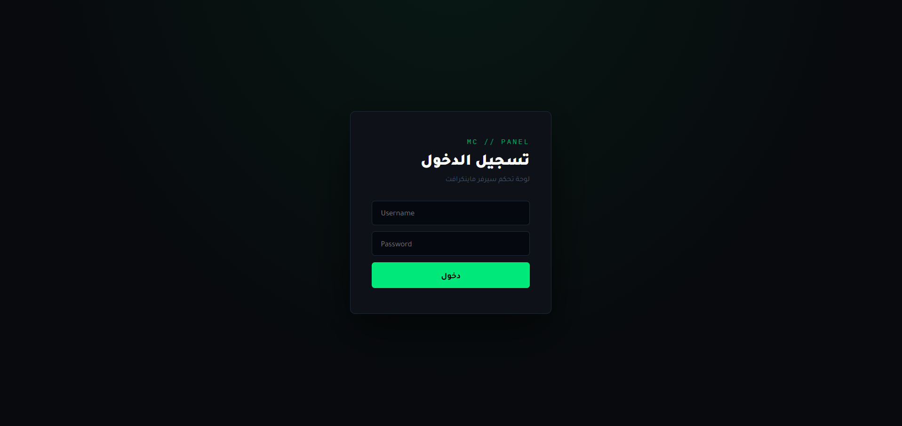

# MC Panel

لوحة تحكم ويب لإدارة سيرفر Minecraft (Paper/Spigot) من المتصفح، بدل الدخول بـ SSH كل مرة. تتحكم بالسيرفر عن طريق جلسة tmux، وتعرض الكونسول واللوق مباشرة عبر WebSocket.

## المميزات

- تشغيل، إيقاف، وإعادة تشغيل السيرفر
- إعادة تشغيل تلقائي لو السيرفر طاح من نفسه (كراش، OOM، الخ)، بدون إعادة تشغيل لو الإيقاف كان مقصود من اللوحة
- كونسول مباشر: إرسال أوامر ومتابعة اللوق لحظيًا
- إحصائيات لحظية: TPS، استهلاك الرام، مدة التشغيل
- إدارة اللاعبين: op، deop، ban، kick، pardon
- عرض قوائم المشرفين (ops)، المحظورين، والـ whitelist
- مدير ملفات كامل: تصفح، فتح وتعديل، رفع، تنزيل، حذف. الوصول محصور داخل مجلد السيرفر فقط
- نسخ احتياطي: إنشاء نسخة (العوالم + server.properties + ops/whitelist/bans)، استرجاع، حذف، تنزيل
- تعديل server.properties وإعدادات الذاكرة/JVM (Xms، Xmx، G1GC، فلاقز إضافية) من الواجهة مباشرة
- تسجيل دخول بمستخدم واحد، الباسورد مشفر بـ bcrypt، مع حد أقصى لمحاولات الدخول الفاشلة
- واجهة عربية بالكامل (RTL)، فيها وضع داكن ووضع فاتح

## المتطلبات

- Linux مع tmux مثبت
- Node.js إصدار 18 فأعلى
- Java (لتشغيل سيرفر Minecraft نفسه)
- سيرفر Paper/Spigot جاهز مسبقًا: ملف jar وعوالمه موجودين في مجلد على الجهاز

اللوحة لا تُنزّل أو تُعدّ سيرفر Minecraft لك، هي فقط تدير سيرفر موجود مسبقًا.

## التثبيت

```bash
git clone https://github.com/tlomts-dev/mcpanel panel
cd panel
npm install
cp .env.example .env
```

بعدين افتح ملف `.env` وعدّل القيم، خصوصًا `MC_DIR` (مسار سيرفر Minecraft الفعلي)، `MC_JAR` (اسم ملف الـ jar)، و`ADMIN_PASS`.

## التشغيل

```bash
npm start
```

اللوحة تفتح على المنفذ المحدد في `PORT` (افتراضيًا 8080):

```
http://<عنوان-الجهاز>:8080
```

سجّل الدخول بـ `ADMIN_USER` و`ADMIN_PASS` من ملف `.env`.

للتشغيل الدائم في بيئة إنتاج، استخدم مدير عمليات بدل تشغيل الأمر مباشرة في الطرفية:

```bash
npm install -g pm2
pm2 start server.js --name mc-panel
pm2 save
```

## متغيرات البيئة

| المتغير | الوصف | الافتراضي |
|---|---|---|
| `PORT` | منفذ اللوحة | `8080` |
| `MC_DIR` | مجلد سيرفر Minecraft (فيه الـ jar والعوالم)، مستقل عن مكان اللوحة | `/opt/minecraft` |
| `MC_JAR` | اسم ملف jar السيرفر بالضبط | `spigot-1.21.11.jar` |
| `TMUX_SESSION` | اسم جلسة tmux اللي يشتغل فيها السيرفر | `mcserver` |
| `SESSION_SECRET` | مفتاح تشفير الجلسات. لو فاضي، يتولد عشوائي عند كل تشغيل، فيسجل خروج الجميع بعد كل إعادة تشغيل للوحة | عشوائي |
| `ADMIN_USER` | اسم مستخدم الدخول | `admin` |
| `ADMIN_PASS` | كلمة المرور، نص عادي | - |
| `ADMIN_HASH` | هاش bcrypt جاهز للباسورد، يستخدم بدل `ADMIN_PASS` لو موجود | - |

توليد `SESSION_SECRET`:
```bash
node -e "console.log(require('crypto').randomBytes(32).toString('hex'))"
```

توليد `ADMIN_HASH` بدل تخزين الباسورد كنص صريح:
```bash
node -e "console.log(require('bcryptjs').hashSync('كلمة-المرور-هنا', 12))"
```

## هيكل المشروع

```
panel/
├── server.js          سيرفر Express + WebSocket، فيه كل الـ API
├── package.json
├── .env.example
└── public/
    └── index.html      واجهة اللوحة (HTML وCSS وJS في ملف واحد)
```



## ملاحظات أمنية

اللوحة تعطي تحكم كامل بالسيرفر: تشغيل وإيقاف، حذف ملفات، تنفيذ أوامر console. لا تعرّض المنفذ مباشرة على الإنترنت. الأفضل reverse proxy (nginx أو Caddy) مع شهادة HTTPS فوقه، أو تقييد الوصول بجدار ناري أو VPN.

الكوكيز مضبوطة بـ `httpOnly` و`sameSite: strict`، لكن بدون `secure` صريح في الكود. الحماية الكاملة تحتاج HTTPS فعليًا في طبقة الـ reverse proxy.

غيّر `ADMIN_PASS` الافتراضي قبل أي استخدام حقيقي. فلترة الأوامر ومدير الملفات فيهم حماية من path traversal وحقن الشل، لكن هذا لا يغني عن تقييد من يوصل للوحة أساسًا.

## الرخصة

MIT، انظر ملف `LICENSE`.
